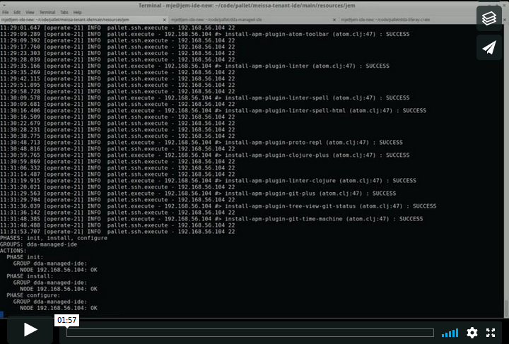

# dda-managed-ide
[](https://clojars.org/dda/dda-managed-ide)
[](https://travis-ci.org/DomainDrivenArchitecture/dda-managed-ide)

[](https://clojurians.slack.com/messages/#dda-pallet/) | [ DevOps Hacking with Clojure](https://www.meetup.com/de-DE/preview/dda-pallet-DevOps-Hacking-with-Clojure) | [Website & Blog](https://domaindrivenarchitecture.org)

## Compatibility

This crate works with:
 * pallet 0.9
 * clojure 1.9
 * xubuntu 16.04.02

## Features

This crate builds on top of the dda-managed-vm to additionally provide a development environment.

[](https://vimeo.com/247506291)

It crate automatically installs software on a Linux system. It can be a standalone system, but normally it would be a virtual machine. For this reason we usually refer to the system as "virtual machine" in the text below.

As this crate is build on top of the dda-managed-vm, all the software and tools that is installed by the vm, can also
be installed with the ide. For the vm-type :desktop the maximum desktop setup is used (:desktop-office). The configuration is detailed in the reference. For more details on the software see: https://github.com/DomainDrivenArchitecture/dda-managed-vm

The following software/packages are installed additionally by dda-managed-ide:

### Dev Platform Clojure Atom
If this dev platform is chosen, then a fully functional clojure and atom setup is provided. For Atom a selection
of necessary plugins is installed. For more information on the plugins see:
```clojure
dda.pallet.dda-managed-ide.domain.atom
```
Then we can access the URL of the server that the ide was installed on and work in pairs on the project.

### Dev Platform Clojure Nightlight
If this dev platform is chosen, then a fully functional clojure and nightlight web server setup is provided. Nightlight is
a clojure ide that can be started from inside a project with:
```
lein nightlight --port 4000.
```
Then we can access the URL of the server that the ide was installed on and work in pairs on the project.

## Usage documentation
This crate installs and configures software on your virtual machine. You can provision pre-created virtual machines (see paragraph "Prepare vm" below) or cloud instances.

### Prepare vm
If you want to use this crate, please ensure you meet the preconditions for the remote machine, i.e. xubuntu and openssh-server installed. If not yet installed, you may use the steps below:
1. Install xubuntu16.04.02
2. Login with your initial user and use:
```
sudo apt-get update
sudo apt-get upgrade
sudo apt-get install openssh-server
```
In case you want to install the software on the local machine rather than remote, you wouldn't need openssh-server but only a Java runtime environment. If not yet available, you can install Java by:
```
sudo apt-get install openjdk-7-jre-headless
```

### Usage Summary
1. Download the jar-file from the releases page of this repository (e.g. dda-manage-ide-x.x.x-standalone.jar).
2. Deploy the jar-file on the source machine
3. Create the files `ide.edn` (Domain-Schema for your desktop) and `target.edn` (Schema for Targets to be provisioned) according to the reference and our example configurations. Please create them in the same folder where you've saved the jar-file. For more information about these files refer to the corresponding information below.
4. Start the installation:
```bash
java -jar dda-managed-ide-standalone.jar --targets targets.edn ide.edn
```
If you want to install the ide on your localhost you don't need a target config.
```bash
java -jar dda-managed-ide-0.2.0-standalone.jar ide.edn
```

### Configuration
The configuration consists of two files defining both WHERE to install the software and WHAT to install.
* `targets.edn`: describes on which target system(s) the software will be installed
* `ide.edn`: describes which software/packages will be installed

You can download examples of these configuration files from  
[https://github.com/DomainDrivenArchitecture/dda-managed-ide/blob/development/targets.edn](https://github.com/DomainDrivenArchitecture/dda-managed-vm/blob/development/targets.edn) and
[https://github.com/DomainDrivenArchitecture/dda-managed-ide/blob/development/ide.edn](https://github.com/DomainDrivenArchitecture/dda-managed-vm/blob/development/vm.edn) respectively.

#### Targets config example
Example content of the file, `targets.edn`:
```clojure
{:existing [{:node-name "test-vm1"            ; semantic name
             :node-ip "35.157.19.218"}]       ; the ip4 address of the machine to be provisioned
 :provisioning-user
 {:login "initial"                            ; account used to provision
  :password {:plain "secure1234"}}}           ; optional password, if no ssh key is authorized
```

#### VM config example
Example content of the file, `ide.edn`:
```clojure
{:vm-type :desktop
 :dev-platform :clojure-atom
 :user {:name "test-user"
        :password {:plain "xxx"}
        :email "test-user@mydomain.org"
        :ssh {:ssh-public-key {:plain "rsa-ssh kfjri5r8irohgn...test.key comment"}
              :ssh-private-key {:plain "123Test"}}}
       :gpg {:gpg-public-key
             {:plain "-----BEGIN PGP ...."
              :gpg-private-key
              {:plain "-----BEGIN PGP ...."}
              :gpg-passphrase {:plain "passphrase"}}}}
```         

The vm config defines the software/packages and user credentials of the newly created user to be installed.

### Watch log for debug reasons
In case of problems you may want to have a look at the log-file:
`less logs/pallet.log`

## Reference
Some details about the architecture: We provide two levels of API. **Domain** is a high-level API with many build in conventions. If this conventions don't fit your needs, you can use our low-level **infra** API and realize your own conventions.

### Targets
The schema for the targets config is:
```clojure
(def ExistingNode
  "Represents a target node with ip and its name."
  {:node-name s/Str   ; semantic name (keep the default or use a name that suits you)
   :node-ip s/Str})   ; the ip4 address of the machine to be provisioned

(def ExistingNodes
  "A sequence of ExistingNodes."
  {s/Keyword [ExistingNode]})

(def ProvisioningUser
  "User used for provisioning."
  {:login s/Str                                ; user on the target machine, must have sudo rights
   (s/optional-key :password) secret/Secret})  ; password can be ommited, if a ssh key is authorized

(def Targets
  "Targets to be used during provisioning."
  {:existing [ExistingNode]                                ; one ore more target nodes.
   (s/optional-key :provisioning-user) ProvisioningUser})  ; user can be ommited to execute on localhost with current user.
```
The "targets.edn" uses this schema.

### Domain API
The schema for the ide configuration is:
```clojure

(def Secret                         ; see dda-pallet-commons
  (either
    {:plain Str}                    ;   as plain text
    {:password-store-single Str}    ;   as password store key wo linebreaks & whitespaces
    {:password-store-record         ;   as password store entry containing login (record :login)
      {:path Str,                   ;      and password (no field or :password)
       :element (enum :password :login)}}
    {:password-store-multi Str}     ;   as password store key with linebreaks
    {:pallet-secret {:key-id Str,
                    :service-path [Keyword],
                    :record-element (enum :secret :account)}})

(def User                           ; see dda-user-crate
  {:password Secret,
   :name Str,
   (optional-key :gpg) {:gpg-passphrase Secret
                        :gpg-public-key Secret
                        :gpg-private-key Secret}
   (optional-key :ssh) {:ssh-private-key Secret
                        :ssh-public-key Secret}})

(def Bookmarks                      ; see dda-managed-vm
  [{(optional-key :childs) [(recursive
                           (var
                            dda.pallet.dda-managed-vm.infra.mozilla/Folder))],
  :name Str,
  (optional-key :links) [[(one Str "url") (one Str "name")]]}])

(def RepoAuth
  {:password Secret
   :username Secret
   :repo Str})

(def DdaIdeDomainConfig
   {:vm-type                        ; remote: all featured software, no vbox-guest-utils
      (enum :remote :desktop),      ; desktop: vbox-guest utils, all featured software, no vnc
    :dev-platform                   ; clojure-atom: full clojure and atom setup
      (enum :clojure-atom           ; clojure-nightlight: full clojure and nightlight web server setup
            :clojure-nightlight),
    :user User                      ; user to create with his credentials
    (optional-key :lein-auth) [RepoAuth],
    (optional-key :bookmarks) Bookmarks, ; initial bookmarks
    (optional-key :email) Str       ; email for git config
  }})
```

### Infra API
The Infra configuration is a configuration on the infrastructure level of a crate. It contains the complete configuration options that are possible with the crate functions. You can find the details of the infra configurations at the other crates used:
* [dda-user-crate](https://github.com/DomainDrivenArchitecture/dda-user-crate)
* [dda-git-crate](https://github.com/DomainDrivenArchitecture/dda-git-crate)
* [dda-serverspec-crate](https://github.com/DomainDrivenArchitecture/dda-serverspec-crate)

For installation & configuration with the dda-managed-ide the schema is:
```clojure
(def DdaIdeConfig
  {(optional-key :clojure) {:os-user-name Str,
                            (optional-key :signing-gpg-key) Str,
                            (optional-key :lein-auth) [{:password Str,
                                                        :username Str,
                                                        :repo Str}],
                            (optional-key :settings) #{(enum
                                                        :install-nightlight)}},
   (optional-key :atom) {(optional-key :plugins) [Str],
                         :settings #{(enum :install-aws-workaround)}},
   :ide-user Keyword}
```

## License
Published under [apache2.0 license](LICENSE.md)
