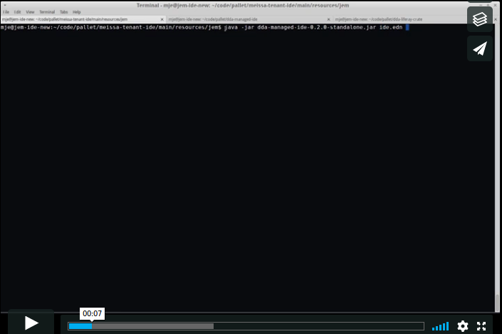

# dda-managed-ide

 | [<img src="https://domaindrivenarchitecture.org/img/meetup.svg" width=50 alt="DevOps Hacking with Clojure Meetup"&gt; DevOps Hacking with Clojure](https://www.meetup.com/de-DE/preview/dda-pallet-DevOps-Hacking-with-Clojure) | [Website & Blog](https://domaindrivenarchitecture.org)

## Compatibility

This crate works with:
* pallet 0.9
* clojure 1.9
* xubuntu 18.04

## Features

This crate builds on top of the dda-managed-vm and therefore provides a development environment in addition to all the software packages and tools the dda-managed-vm installs.

This crate automatically installs software on a Linux system. The target can be a standalone system but in most cases we prefer virtual machines as they offer snapshots and easy relocation.

We abstracted away some configuration in our domain layer to use :virtualbox as the target type for the installation. If you wish to use another target type or different defaults you can define your own domain convention rather easily.

The dda-managed-ide installs the following packages in addition to the packages of the managed-vm:

* clojure
* lein with profiles & credentials
* java
* custom jdk & gradle
* java-script
* custom nodejs, npm & yarn
* devops
* docker-host with configuration for bridge networking
* aws-cli with simple credentials configuration
* mfa tool
* terraform
* packer
* mach for terraform & dda-pallet integration
* aws-amicleaner
* atom with plugins for
* clojure language & repl
* java language
* terraform, packer, json
* intellij
* configure inodes for idea
* others
* git with configuration
* yed, argouml (uml / diagram)
* dbvis (sql)
* asciinema & animated gif generation
* many more os-level tools like strace, iotop ...

## Usage documentation
This crate installs and configures software on your target system. You can provision pre-created virtual machines (see paragraph "Prepare vm" below), standalone systems or cloud instances.

### Prepare vm
In order to use this crate you need a running opennssh-server. If you do not already have a running ssh service use the steps below to install it
1. Install xubuntu18.04
2. Login with your initial user and use:
'''
sudo apt-get update
sudo apt-get upgrade
sudo apt-get install openssh-server
'''
If you want to provision by a local jar file you need a java runtime environment installed on your target system. If you do not already have java installed you can follow the steps below to install it:
'''
sudo apt-get install openjdk-11-jre-headless
'''

### Usage Summary
1. Download the jar-file from the releases page of this repository (e.g. 'curl -L -o managed-ide.jar https://github.com/DomainDrivenArchitecture/dda-managed-ide/releases/download/2.0.0/dda-managed-ide-2.0.0-standalone.jar').
2. Deploy the jar-file on the source machine
3. Create the files 'example-ide.edn' (Domain-Schema for your desktop) and 'target.edn' (Schema for Targets to be provisioned) according to the reference and our example configurations. Please create them in the same folder where you have saved the jar-file. For more information about these files refer to the corresponding information below.
4. Start the installation:
'''bash
java -jar managed-ide.jar --targets example-targets.edn example-ide.edn
'''
If you want to install the ide on your localhost you don't need a target config.
'''bash
java -jar managed-ide.jar example-ide.edn
'''

### Configuration
The configuration consists of two files defining both WHERE to install the software and WHAT to install.
* 'example-targets.edn': describes on which target system(s) the software will be installed
* 'example-ide.edn': describes which software/packages will be installed

You can download examples of these configuration files from
[example-targets.edn](example-targets.edn) and
[example-ide.edn](example-ide.edn), respectively.

#### Targets config example
Example content of the file 'example-targets.edn':
'''clojure
{:existing [{:node-name "test-vm1" ; semantic name
:node-ip "35.157.19.218"}] ; the ip4 address of the machine to be provisioned
:provisioning-user
{:login "initial" ; account used to provision
:password {:plain "secure1234"}}} ; optional password, if no ssh key is authorized
'''

#### IDE config example
Example content of the file, 'example-ide.edn':
'''clojure
{:target-type :virtualbox
:clojure {:lein-auth [{:repo "maven.my-repo.com"
:username {:plain "mvn-account"}
:password {:plain "mvn-password"}}]}
:java {}
:java-script {}
:devops {:aws {:simple {:id {:plain "ACCESS_KEY"}
:secret {:plain "SECRET_KEY"}}}}
:ide-platform #{:atom}
:user {:name "test-user"
:password {:plain "xxx"}
:email "test-user@mydomain.org"
:ssh {:ssh-public-key {:plain "rsa-ssh kfjri5r8irohgn...test.key comment"}
:ssh-private-key {:plain "123Test"}}}
:gpg {:gpg-public-key
{:plain "-----BEGIN PGP ...."
:gpg-private-key
{:plain "-----BEGIN PGP ...."}
:gpg-passphrase {:plain "passphrase"}}}}
'''

The ide config creates a new user with the provided credentials and installs the defined software and packages for the new user.

### Watch log for debug reasons
In case any problems occur you may want to have a look at the log-file:
'less logs/pallet.log'

## Reference
Some details about the architecture: We provide two levels of API. **Domain** is a high-level API with built-in conventions. If these conventions do not fit your needs you can use our low-level **infra** API and realize your own conventions.

### Targets
You can define provisioning targets using the [targets-schema](https://github.com/DomainDrivenArchitecture/dda-pallet-commons/blob/master/doc/existing_spec.md)

### Domain API
You can use our conventions as a starting point:
[see domain reference](doc/reference_domain.md)

### Infra API
Or you can build your own conventions using our low level infra API. We will keep this API backward compatible whenever possible:
[see infra reference](doc/reference_infra.md)

## License
Published under [apache2.0 license](LICENSE.md)
